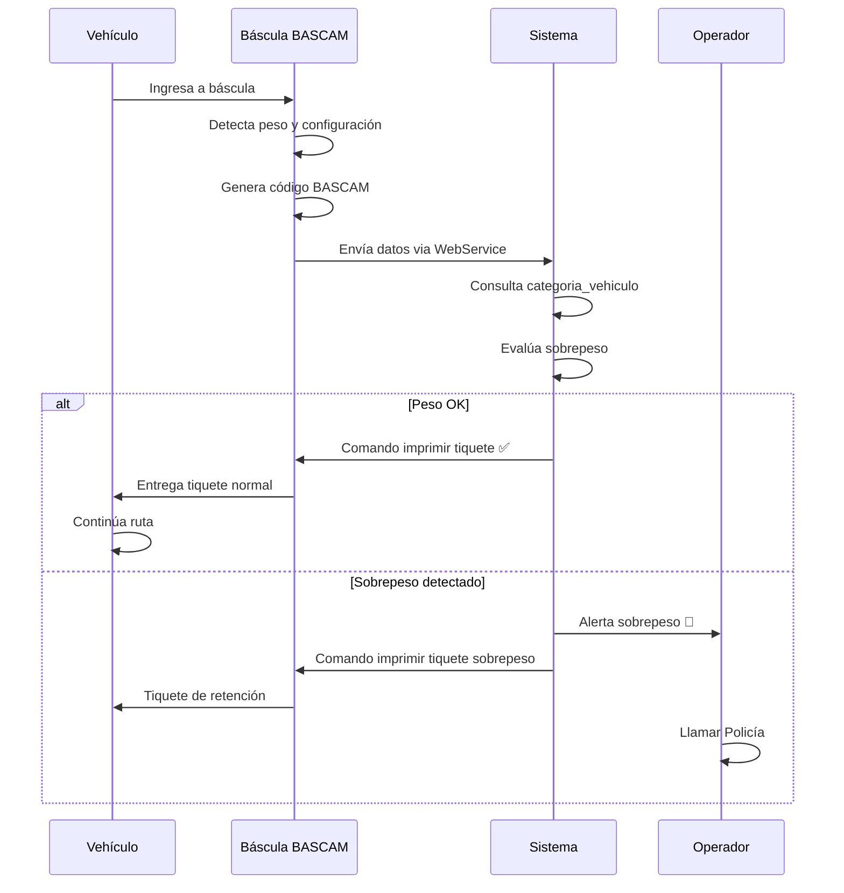
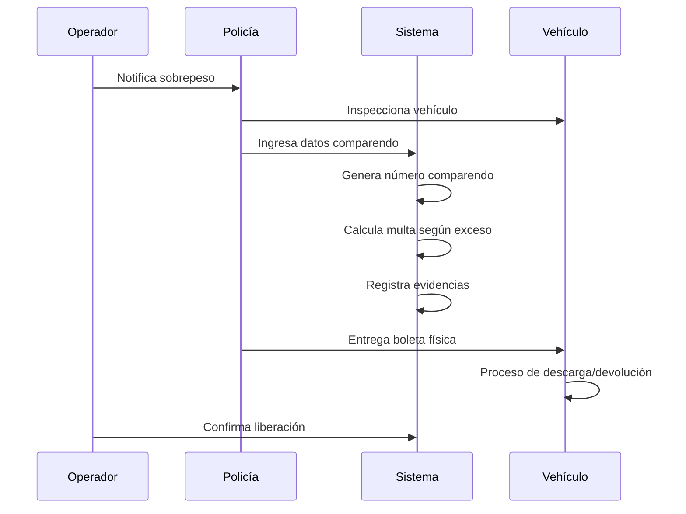
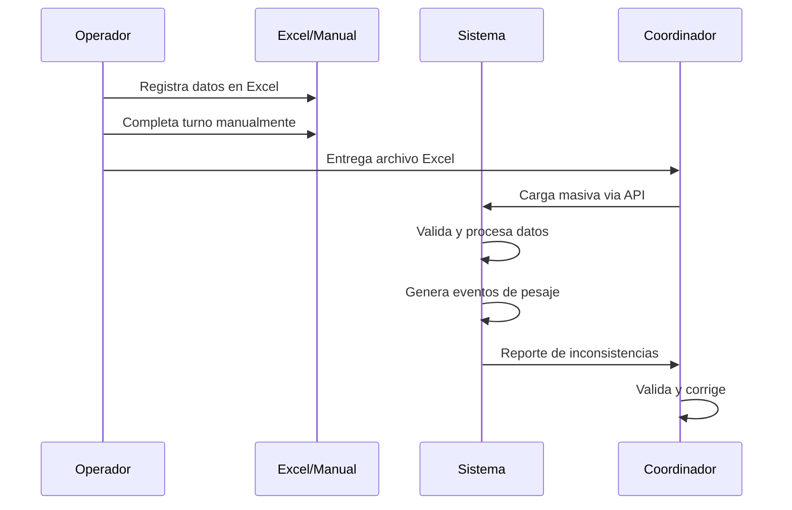

# 📊 Sistema Comparendos - Contexto Completo para Desarrollo de HU

**Versión:** 1.0  
**Fecha:** 5 Junio 2025  
**Propósito:** Base completa para especificación de nuevas HU del sistema comparendos  
**Origen:** Migración y adaptación del sistema vehiculos especiales  

---

## 🎯 **1. CONTEXTO DEL PROYECTO**

### **1.1 Historia del Proyecto**
- **Sistema Original**: Control de vehículos especiales multi-peaje (Neiva, El Patá, Flandes)
- **Funcionalidad Original**: Gestión de tarifas especiales, conteo de pasos, exclusiones automáticas
- **Estado Actual**: 11 HU certificadas y funcionales
- **Migración**: Sistema clonado, depurado y levantado en nuevo ambiente
- **Objetivo**: Adaptar funcionalidades existentes para gestión de comparendos por sobrepeso

### **1.2 Nuevo Modelo de Negocio - Comparendos BASCAM**

#### **Propósito Estratégico**
Garantizar el cumplimiento normativo de límites de peso en vehículos de carga mediante un sistema integral que digitalice el proceso de pesaje, emisión de tiquetes, generación de comparendos y reporte a autoridades (ANI/Supertransporte).

#### **Stakeholders del Sistema**
| Stakeholder | Rol | Necesidad Principal |
|-------------|-----|-------------------|
| **Operador de Báscula** | Usuario principal | Herramienta rápida para registrar pesajes y sobrepesos |
| **Policía de Carreteras** | Generador comparendos | Evidencia digital para imponer comparendos |
| **Coordinador ITS** | Supervisor | Consolidar datos diarios, validar formatos |
| **Coordinador CCO** | Monitor | Monitorear incidentes y coordinar respuestas |
| **Ingeniero Residente** | Autorizador | Autorizar devoluciones excepcionales |
| **ANI/Supertransporte** | Regulador | Recibir reportes mensuales homologados |
| **Transportista** | Afectado | Conocer sanciones y evidencias |

#### **Volumen Operativo**
- **4 Estaciones**: Norte/Sur Neiva, Norte/Sur Flandes
- **Flujo estimado**: ~1,152 pesajes/día (4 estaciones × 12 vh/h × 24h)
- **Sobrepesos**: ~8% (≈90/día)
- **Comparendos**: Variable según presencia policial (≈60%)

### **1.3 Marco Normativo**
- **Resolución 2460 de 2022**: Nuevos límites de peso y reportes
- **Decreto 767 de 1993**: Regula pesajes, sanciones y autoridad vial
- **Resolución 4100 de 2018**: Parámetros técnicos de básculas
- **Contrato de Concesión**: Obligación control de peso y reportes mensuales

---

## 🏗️ **2. ARQUITECTURA ACTUAL DEL SISTEMA CLONADO**

### **2.1 Estructura del Proyecto Migrado**
```
sistema-comparendos/
├── 📁 apps/backend/
│   ├── 📁 src/
│   │   ├── 📁 controllers/
│   │   │   ├── auth.controller.js
│   │   │   ├── comparendos.controller.js
│   │   │   ├── vehiculo.controller.js
│   │   │   ├── historico.controller.js
│   │   │   └── paso.controller.js
│   │   ├── 📁 routes/
│   │   │   ├── authRoutes.js
│   │   │   ├── comparendosRoutes.js
│   │   │   ├── vehiculoRoutes.js
│   │   │   ├── pasoRoutes.js
│   │   │   ├── historicoRoutes.js
│   │   │   └── exclusionesRoutes.js
│   │   └── 📁 middleware/
│   │       └── auth.middleware.js
```

### **2.2 APIs Disponibles (Migradas)**
```javascript
// Autenticación
POST /api/auth/login
GET /api/auth/me
POST /api/auth/logout

// Comparendos (Base existente)
GET /api/comparendos
GET /api/comparendos/placa/:placa
POST /api/comparendos
PUT /api/comparendos/:id
DELETE /api/comparendos/:id
POST /api/comparendos/carga-excel
POST /api/comparendos/carga-json

// Vehículos (Reutilizable)
GET /api/vehiculos
GET /api/vehiculos/placa/:placa
POST /api/vehiculos
PUT /api/vehiculos/:id
DELETE /api/vehiculos/:id

// Histórico (Adaptable)
GET /api/historico
GET /api/historico/placa/:placa
POST /api/historico/corregir
POST /api/historico/exportar
POST /api/historico/consolidar

// Pasos (Convertir a Pesajes)
GET /api/pasos
GET /api/pasos/placa/:placa
POST /api/pasos
PUT /api/pasos/:id

// Exclusiones (Mantener)
GET /api/exclusiones
POST /api/exclusiones
PUT /api/exclusiones/:id
DELETE /api/exclusiones/:id
POST /api/exclusiones/revertir

// Peajes (Convertir a Estaciones)
GET /api/peajes
POST /api/peajes
PUT /api/peajes/:id
DELETE /api/peajes/:id
```

### **2.3 Base de Datos Actual (PostgreSQL)**
```sql
-- Tablas principales heredadas del sistema vehiculos
CREATE TABLE vehiculos (
    placa VARCHAR(6) PRIMARY KEY,
    codigo_tarjeta VARCHAR(50),
    marca_vehiculo VARCHAR(50),
    usuario VARCHAR(100),
    color_vehiculo VARCHAR(30),
    categoria_vehiculo VARCHAR(50),
    activo BOOLEAN DEFAULT true,
    conteo_pasos INTEGER DEFAULT 0,
    tipo_servicio VARCHAR(50),
    id_peaje INTEGER NOT NULL
);

CREATE TABLE comparendos (
    id INTEGER PRIMARY KEY,
    fecha DATE NOT NULL,
    hora TIME NOT NULL,
    numero_ticket VARCHAR(20) NOT NULL,
    placa VARCHAR(10) NOT NULL,
    sobre_peso INTEGER,
    numero_comparendo VARCHAR(50) NOT NULL,
    detalle TEXT,
    pk VARCHAR(20),
    latitud DOUBLE PRECISION,
    longitud DOUBLE PRECISION,
    id_bascula INTEGER
);

CREATE TABLE basculas (
    id_bascula INTEGER PRIMARY KEY,
    nombre VARCHAR(50) NOT NULL,
    ubicacion TEXT NOT NULL,
    activo BOOLEAN DEFAULT true,
    latitud DOUBLE PRECISION,
    longitud DOUBLE PRECISION
);

CREATE TABLE pasos (
    id INTEGER PRIMARY KEY,
    placa VARCHAR(6),
    fecha_hora TIMESTAMP DEFAULT now(),
    id_peaje INTEGER NOT NULL,
    fecha_paso TIMESTAMP DEFAULT now()
);

CREATE TABLE usuarios (
    id INTEGER PRIMARY KEY,
    nombre VARCHAR(100),
    email VARCHAR(100) NOT NULL UNIQUE,
    password_hash TEXT NOT NULL,
    rol INTEGER NOT NULL
);
```

---

## 🔄 **3. ANÁLISIS DE REUTILIZACIÓN HU ORIGINALES (1-11)**

### **3.1 HU-VH-001: Control mensual de pasos (multi-peaje)**
- **Estado**: 🟡 **ADAPTAR**
- **Nueva función**: Control de eventos de pesaje por estación
- **Reutilización**: APIs de consulta de vehículos
- **Adaptación requerida**: Cambiar "pasos" por "pesajes", añadir datos de peso

### **3.2 HU-VH-002: Carga de vehículos con tarifa especial**
- **Estado**: 🟢 **MANTENER**
- **Nueva función**: Registro de vehículos de carga sujetos a control
- **Reutilización**: API completa de carga de vehículos
- **Adaptación requerida**: Cambiar "tarifa especial" por "categoria BASCAM"

### **3.3 HU-VH-003: Conteo de pasos desde plantilla mensual**
- **Estado**: 🟡 **ADAPTAR**
- **Nueva función**: Carga de pesajes históricos
- **Reutilización**: Lógica de carga masiva Excel
- **Adaptación requerida**: Incluir datos de peso y clasificación BASCAM

### **3.4 HU-VH-004: DEPRECATED**
- **Estado**: ❌ **NO APLICA**
- **Razón**: Ya deprecada en sistema original

### **3.5 HU-VH-005: Reinicio mensual del conteo de pasos**
- **Estado**: 🔴 **DEPRECAR**
- **Razón**: No aplica para comparendos (no hay ciclos mensuales de reinicio)
- **Alternativa**: Procesos de cierre de turno

### **3.6 HU-VH-006: Validación histórica y exclusión automática**
- **Estado**: 🟡 **ADAPTAR**
- **Nueva función**: Validación de vehículos oficiales exentos
- **Reutilización**: Lógica de exclusiones
- **Adaptación requerida**: Criterios de exclusión para emergencias/oficiales

### **3.7 HU-VH-007: Reversión manual del beneficio**
- **Estado**: 🟡 **ADAPTAR**
- **Nueva función**: Anulación de comparendos por error
- **Reutilización**: Lógica de reversión con auditoría
- **Adaptación requerida**: Cambiar contexto de "beneficio" a "comparendo"

### **3.8 HU-VH-008: Panel histórico y trazabilidad por placa**
- **Estado**: 🟢 **MANTENER**
- **Nueva función**: Historial de pesajes y comparendos por vehículo
- **Reutilización**: APIs de consulta histórica completas
- **Adaptación requerida**: Mínima, solo contexto visual

### **3.9 HU-VH-009: Consulta de discrepancias por rol**
- **Estado**: 🟡 **ADAPTAR**
- **Nueva función**: Validación de datos de pesaje inconsistentes
- **Reutilización**: Lógica de validación por roles
- **Adaptación requerida**: Criterios de discrepancia para peso/clasificación

### **3.10 HU-VH-010: Registro y trazabilidad de exclusiones**
- **Estado**: 🟢 **MANTENER**
- **Nueva función**: Log de anulaciones y reversiones de comparendos
- **Reutilización**: Sistema completo de logging
- **Adaptación requerida**: Mínima

### **3.11 HU-VH-011: Validación de plantillas Excel**
- **Estado**: 🟢 **MANTENER**
- **Nueva función**: Validación de cargas masivas de pesajes
- **Reutilización**: Validador completo de Excel
- **Adaptación requerida**: Nuevas columnas para peso y clasificación

### **3.12-3.18: HU del 12 al 18 (No implementadas)**
- **Estado**: ❌ **NO DISPONIBLES**
- **Razón**: Fueron desarrolladas después del punto de clonación
- **Disponibles para referencia**: Especificaciones técnicas

---

## 🚀 **4. NUEVA ESTRUCTURA DE HU PROPUESTA**

### **4.1 Arquitectura de HU por Fases**

#### **FASE 1: Fundamentos (HU-01 a HU-04)**
**Objetivo**: Operación básica de comparendos por sobrepeso

#### **FASE 2: Operación Avanzada (HU-05 a HU-08)**
**Objetivo**: Gestión completa con reportes y validaciones

#### **FASE 3: Integración y Reportes (HU-09 a HU-12)**
**Objetivo**: Dashboards, ANI/Supertransporte, análisis

### **4.2 Mapeo de HU Nuevas (Orden de Desarrollo)**

| HU Nueva | Título | Origen/Reutilización | Prioridad | Fase |
|----------|--------|-------------------|-----------|------|
| **HU-01** | Autenticación y Roles del Sistema | HU-VH-000 + adaptación | CRÍTICA | 1 |
| **HU-02** | Gestión de Vehículos de Carga | HU-VH-002 (90% reutilización) | CRÍTICA | 1 |
| **HU-03** | Clasificación Automática BASCAM | NUEVA (core del negocio) | CRÍTICA | 1 |
| **HU-04** | Registro de Eventos de Pesaje | HU-VH-003 + HU-VH-015 | CRÍTICA | 1 |
| **HU-05** | Generación de Comparendos por Sobrepeso | Base existente + mejoras | ALTA | 2 |
| **HU-06** | Gestión de Vehículos Oficiales Exentos | HU-VH-006 (adaptación) | ALTA | 2 |
| **HU-07** | Carga Masiva y Contingencias | HU-VH-011 + HU-VH-003 | ALTA | 2 |
| **HU-08** | Anulación y Corrección de Comparendos | HU-VH-007 (adaptación) | ALTA | 2 |
| **HU-09** | Consultas y Trazabilidad por Vehículo | HU-VH-008 (95% reutilización) | MEDIA | 3 |
| **HU-10** | Dashboard Operativo en Tiempo Real | HU-VH-018 (adaptación) | MEDIA | 3 |
| **HU-11** | Reportes ANI y Supertransporte | NUEVA (requerimiento legal) | MEDIA | 3 |
| **HU-12** | Gestión de Estaciones y Básculas | HU-VH-013 + HU-VH-014 | BAJA | 3 |

---

## 📋 **5. ESPECIFICACIONES DETALLADAS POR HU**

### **HU-01: Autenticación y Roles del Sistema**
**Origen**: HU-VH-000 (Validaciones Generales de Seguridad y Roles)
**Reutilización**: 80% - APIs de auth existentes
**Nuevos Roles Requeridos**:
- Operador de Báscula (principal)
- Agente de Policía (generación comparendos)
- Coordinador ITS (supervisión)
- Coordinador CCO (monitoreo)
- Ingeniero Residente (autorizaciones)

**APIs a Reutilizar**:
```javascript
POST /api/auth/login // ✅ Mantener exacta
GET /api/auth/me     // ✅ Mantener exacta
POST /api/auth/logout // ✅ Mantener exacta
```

**Adaptaciones Requeridas**:
- Expandir tabla `usuarios` con nuevos roles
- Middleware de autorización para operaciones de báscula
- Validaciones específicas por estación

---

### **HU-02: Gestión de Vehículos de Carga**
**Origen**: HU-VH-002 (Carga de vehículos con tarifa especial)
**Reutilización**: 90% - Estructura completa aprovechable

**APIs a Reutilizar**:
```javascript
GET /api/vehiculos              // ✅ Mantener
GET /api/vehiculos/placa/:placa // ✅ Mantener
POST /api/vehiculos             // ✅ Mantener
PUT /api/vehiculos/:id          // ✅ Mantener
```

**Adaptaciones de BD Requeridas**:
```sql
-- Añadir a tabla vehiculos existente
ALTER TABLE vehiculos ADD COLUMN categoria_id INTEGER;
ALTER TABLE vehiculos ADD COLUMN empresa_transporte VARCHAR(200);
ALTER TABLE vehiculos ADD COLUMN numero_interno VARCHAR(50);
ALTER TABLE vehiculos ADD FOREIGN KEY (categoria_id) 
    REFERENCES categoria_vehiculo(id);
```

**Nueva Tabla Core**:
```sql
CREATE TABLE categoria_vehiculo (
    id SERIAL PRIMARY KEY,
    codigo_bascam VARCHAR(10) NOT NULL UNIQUE,
    descripcion_bascam VARCHAR(100),
    configuracion_normativa VARCHAR(50),
    peso_maximo_kg NUMERIC(8,1) NOT NULL,
    tolerancia_kg NUMERIC(8,1) NOT NULL,
    peso_total_permitido_kg NUMERIC(8,1) GENERATED ALWAYS AS 
        (peso_maximo_kg + tolerancia_kg) STORED,
    norma_referencia VARCHAR(50) DEFAULT '2460/22-Anexo II',
    activo BOOLEAN DEFAULT true
);
```

---

### **HU-03: Clasificación Automática BASCAM**
**Origen**: NUEVA (Core del modelo de negocio)
**Reutilización**: 0% - Funcionalidad completamente nueva

**Funcionalidad Principal**:
- Integración con WebService BASCAM
- Clasificación automática de vehículos por configuración de ejes
- Determinación automática de límites de peso
- Alertas de sobrepeso en tiempo real

**APIs Nuevas Requeridas**:
```javascript
GET /api/categorias-vehiculo           // Lista clasificaciones BASCAM
GET /api/categorias-vehiculo/:codigo   // Detalles por código BASCAM
POST /api/bascam/clasificar           // Clasificación automática
GET /api/bascam/webservice/status     // Estado integración WebService
```

**Tabla de Configuración BASCAM**:
```sql
INSERT INTO categoria_vehiculo (codigo_bascam, descripcion_bascam, peso_maximo_kg, tolerancia_kg) VALUES
('C2', 'Camión 2 ejes', 17000, 700),
('C3', 'Camión 3 ejes', 28000, 1200),
('2S1', 'Tracto 2 + Semirrem 1', 25000, 625),
('2S2', 'Tracto 2 + Semirrem 2', 29000, 725),
('2S3', 'Tracto 2 + Semirrem 3', 40500, 1013),
('3S2', 'Tracto 3 + Semirrem 2', 48000, 1200),
('3S3', 'Tracto 3 + Semirrem 3', 52000, 1300);
```

---

### **HU-04: Registro de Eventos de Pesaje**
**Origen**: HU-VH-003 (Conteo de pasos) + HU-VH-015 (Registro de pasos)
**Reutilización**: 70% - Lógica de registro masivo

**APIs a Adaptar**:
```javascript
GET /api/pasos → GET /api/pesajes                    // Renombrar
GET /api/pasos/placa/:placa → GET /api/pesajes/placa/:placa
POST /api/pasos → POST /api/pesajes                  // Expandir datos
POST /api/pasos/carga-excel → POST /api/pesajes/carga-excel
```

**Adaptación de Tabla**:
```sql
-- Evolucionar tabla pasos → eventos_pesaje
CREATE TABLE eventos_pesaje (
    id SERIAL PRIMARY KEY,
    placa VARCHAR(10) NOT NULL,
    fecha_pesaje TIMESTAMP DEFAULT CURRENT_TIMESTAMP,
    id_estacion INTEGER NOT NULL,
    id_bascula INTEGER,
    peso_bruto_kg NUMERIC(8,1),
    peso_neto_kg NUMERIC(8,1),
    codigo_bascam VARCHAR(10),
    categoria_id INTEGER,
    limite_aplicado_kg NUMERIC(8,1),
    exceso_kg NUMERIC(8,1) DEFAULT 0,
    tiene_sobrepeso BOOLEAN DEFAULT false,
    evidencia_foto_path TEXT,
    observaciones TEXT,
    operador_usuario_id INTEGER,
    FOREIGN KEY (categoria_id) REFERENCES categoria_vehiculo(id),
    FOREIGN KEY (id_bascula) REFERENCES basculas(id_bascula)
);
```

---

### **HU-05: Generación de Comparendos por Sobrepeso**
**Origen**: Base existente en comparendos + mejoras
**Reutilización**: 60% - Estructura base de comparendos

**APIs a Expandir**:
```javascript
// Mantener APIs existentes + nuevas funcionalidades
POST /api/comparendos                     // ✅ Expandir
GET /api/comparendos                      // ✅ Mantener
PUT /api/comparendos/:id                  // ✅ Expandir
DELETE /api/comparendos/:id → ANULAR      // Cambiar DELETE por anulación
```

**Expansión de Tabla Comparendos**:
```sql
-- Expandir tabla comparendos existente
ALTER TABLE comparendos ADD COLUMN evento_pesaje_id INTEGER;
ALTER TABLE comparendos ADD COLUMN categoria_id INTEGER;
ALTER TABLE comparendos ADD COLUMN agente_policia VARCHAR(100);
ALTER TABLE comparendos ADD COLUMN placa_agente VARCHAR(10);
ALTER TABLE comparendos ADD COLUMN peso_detectado_kg NUMERIC(8,1);
ALTER TABLE comparendos ADD COLUMN peso_limite_kg NUMERIC(8,1);
ALTER TABLE comparendos ADD COLUMN exceso_detectado_kg NUMERIC(8,1);
ALTER TABLE comparendos ADD COLUMN valor_multa NUMERIC(12,2);
ALTER TABLE comparendos ADD COLUMN estado_comparendo VARCHAR(20) DEFAULT 'ACTIVO';
ALTER TABLE comparendos ADD COLUMN fecha_anulacion TIMESTAMP;
ALTER TABLE comparendos ADD COLUMN motivo_anulacion TEXT;

-- Foreign Keys
ALTER TABLE comparendos ADD FOREIGN KEY (evento_pesaje_id) 
    REFERENCES eventos_pesaje(id);
ALTER TABLE comparendos ADD FOREIGN KEY (categoria_id) 
    REFERENCES categoria_vehiculo(id);
```

---

### **HU-06: Gestión de Vehículos Oficiales Exentos**
**Origen**: HU-VH-006 (Validación histórica y exclusión automática)
**Reutilización**: 85% - Lógica de exclusiones completa

**APIs a Reutilizar**:
```javascript
GET /api/exclusiones     // ✅ Perfecta para vehículos oficiales
POST /api/exclusiones    // ✅ Registro de vehículos exentos
PUT /api/exclusiones/:id // ✅ Actualización de exenciones
POST /api/exclusiones/revertir // ✅ Reversión de exenciones
```

**Adaptación de Contexto**:
- Cambiar "exclusión de beneficio" por "exención de pesaje"
- Tipos de vehículos oficiales: ambulancias, bomberos, policía, ejército
- Validación automática en eventos de pesaje

---

### **HU-07: Carga Masiva y Contingencias**
**Origen**: HU-VH-011 (Validación plantillas) + HU-VH-003 (Carga masiva)
**Reutilización**: 95% - Sistema de carga Excel completo

**APIs a Reutilizar**:
```javascript
POST /api/comparendos/carga-excel // ✅ Mantener exacta
POST /api/comparendos/carga-json  // ✅ Mantener exacta
POST /api/pesajes/carga-excel     // Adaptar de pasos
```

**Caso de Uso Principal**: Respaldo cuando WebService BASCAM falla
**Validaciones a Mantener**: Estructura Excel, datos obligatorios, duplicados

---

### **HU-08: Anulación y Corrección de Comparendos**
**Origen**: HU-VH-007 (Reversión manual del beneficio)
**Reutilización**: 80% - Lógica de reversión con auditoría

**API Adaptada**:
```javascript
// Cambiar DELETE por anulación controlada
PUT /api/comparendos/:id/anular  // En lugar de DELETE
POST /api/comparendos/:id/corregir // Nueva funcionalidad
```

**Casos de Uso**:
- Error en clasificación BASCAM
- Error de operador
- Vehículo oficial no detectado
- Autorización del ingeniero residente

---

### **HU-09: Consultas y Trazabilidad por Vehículo**
**Origen**: HU-VH-008 (Panel histórico y trazabilidad por placa)
**Reutilización**: 95% - APIs de consulta histórica perfectas

**APIs a Mantener**:
```javascript
GET /api/historico/placa/:placa   // ✅ Perfecta para historial de pesajes
POST /api/historico/exportar      // ✅ Exportación de datos
GET /api/comparendos/placa/:placa // ✅ Comparendos por vehículo
```

---

### **HU-10: Dashboard Operativo en Tiempo Real**
**Origen**: HU-VH-018 (Reportes y Dashboard Operativo)
**Reutilización**: 70% - Estructura de dashboard adaptable

**Métricas Principales**:
- Pesajes del día por estación
- Sobrepesos detectados
- Comparendos generados
- Estado de básculas
- Vehículos en retención

---

### **HU-11: Reportes ANI y Supertransporte**
**Origen**: NUEVA (Requerimiento legal específico)
**Reutilización**: 0% - Funcionalidad específica del negocio

**Reportes Requeridos**:
- Formato ANG-FOP-14: Registro diario de pesajes
- Formato ANG-FOP-15: Sobrepesos detectados
- Formato ANG-FOP-16: Comparendos emitidos
- Formato ANG-FOP-17: Vehículos evasores
- Reporte mensual consolidado ANI

---

### **HU-12: Gestión de Estaciones y Básculas**
**Origen**: HU-VH-013 (Báscula) + HU-VH-014 (Peajes → Estaciones)
**Reutilización**: 90% - APIs de gestión de infraestructura

**APIs a Adaptar**:
```javascript
GET /api/peajes → GET /api/estaciones-control      // Renombrar concepto
GET /api/basculas                                  // ✅ Mantener exacta
POST /api/basculas                                 // ✅ Mantener exacta
PUT /api/basculas/:id                              // ✅ Mantener exacta
```

---

## 🗄️ **6. ESPECIFICACIONES TÉCNICAS DE BD**

### **6.1 Nuevas Tablas Requeridas**

```sql
-- 1. Categorías BASCAM (CORE)
CREATE TABLE categoria_vehiculo (
    id SERIAL PRIMARY KEY,
    codigo_bascam VARCHAR(10) NOT NULL UNIQUE,
    descripcion_bascam VARCHAR(100),
    configuracion_normativa VARCHAR(50),
    peso_maximo_kg NUMERIC(8,1) NOT NULL,
    tolerancia_kg NUMERIC(8,1) NOT NULL,
    peso_total_permitido_kg NUMERIC(8,1) GENERATED ALWAYS AS 
        (peso_maximo_kg + tolerancia_kg) STORED,
    norma_referencia VARCHAR(50) DEFAULT '2460/22-Anexo II',
    vigencia_desde DATE DEFAULT CURRENT_DATE,
    vigencia_hasta DATE,
    activo BOOLEAN DEFAULT true,
    created_at TIMESTAMP DEFAULT CURRENT_TIMESTAMP
);

-- 2. Eventos de Pesaje (Evolución de pasos)
CREATE TABLE eventos_pesaje (
    id SERIAL PRIMARY KEY,
    placa VARCHAR(10) NOT NULL,
    fecha_pesaje TIMESTAMP DEFAULT CURRENT_TIMESTAMP,
    id_estacion INTEGER NOT NULL,
    id_bascula INTEGER,
    peso_bruto_kg NUMERIC(8,1),
    peso_neto_kg NUMERIC(8,1),
    codigo_bascam VARCHAR(10),
    categoria_id INTEGER,
    limite_aplicado_kg NUMERIC(8,1),
    exceso_kg NUMERIC(8,1) DEFAULT 0,
    tiene_sobrepeso BOOLEAN DEFAULT false,
    evidencia_foto_path TEXT,
    tiquete_numero VARCHAR(50),
    operador_usuario_id INTEGER,
    observaciones TEXT,
    estado_evento VARCHAR(20) DEFAULT 'COMPLETADO',
    created_at TIMESTAMP DEFAULT CURRENT_TIMESTAMP,
    FOREIGN KEY (categoria_id) REFERENCES categoria_vehiculo(id),
    FOREIGN KEY (id_bascula) REFERENCES basculas(id_bascula),
    FOREIGN KEY (operador_usuario_id) REFERENCES usuarios(id)
);

-- 3. Infracciones (Catálogo)
CREATE TABLE infracciones (
    id SERIAL PRIMARY KEY,
    codigo_infraccion VARCHAR(20) NOT NULL UNIQUE,
    descripcion TEXT NOT NULL,
    tipo_infraccion VARCHAR(50), -- 'SOBREPESO', 'EVASION', 'DOCUMENTOS'
    valor_base NUMERIC(12,2),
    unidad_medida VARCHAR(20), -- 'FIJO', 'POR_KG_EXCESO'
    normativa_referencia VARCHAR(100),
    activo BOOLEAN DEFAULT true,
    created_at TIMESTAMP DEFAULT CURRENT_TIMESTAMP
);

-- 4. Multas (Cálculos y seguimiento)
CREATE TABLE multas (
    id SERIAL PRIMARY KEY,
    comparendo_id INTEGER NOT NULL,
    infraccion_id INTEGER NOT NULL,
    valor_total NUMERIC(12,2) NOT NULL,
    fecha_vencimiento DATE,
    descuento_pronto_pago NUMERIC(5,2) DEFAULT 0.50,
    valor_con_descuento NUMERIC(12,2),
    estado_pago VARCHAR(20) DEFAULT 'PENDIENTE',
    fecha_pago TIMESTAMP,
    metodo_pago VARCHAR(50),
    referencia_pago VARCHAR(100),
    created_at TIMESTAMP DEFAULT CURRENT_TIMESTAMP,
    FOREIGN KEY (comparendo_id) REFERENCES comparendos(id),
    FOREIGN KEY (infraccion_id) REFERENCES infracciones(id)
);

-- 5. Evidencias multimedia
CREATE TABLE evidencias (
    id SERIAL PRIMARY KEY,
    evento_pesaje_id INTEGER,
    comparendo_id INTEGER,
    tipo_evidencia VARCHAR(20), -- 'FOTO_VEHICULO', 'FOTO_PLACA', 'TIQUETE', 'DOCUMENTO'
    archivo_path TEXT NOT NULL,
    archivo_nombre VARCHAR(255),
    archivo_size BIGINT,
    archivo_hash VARCHAR(64), -- SHA-256 para integridad
    fecha_captura TIMESTAMP DEFAULT CURRENT_TIMESTAMP,
    usuario_captura_id INTEGER,
    descripcion TEXT,
    activo BOOLEAN DEFAULT true,
    FOREIGN KEY (evento_pesaje_id) REFERENCES eventos_pesaje(id),
    FOREIGN KEY (comparendo_id) REFERENCES comparendos(id),
    FOREIGN KEY (usuario_captura_id) REFERENCES usuarios(id)
);

-- 6. Log de auditoría (Expansión)
CREATE TABLE auditoria_sistema (
    id SERIAL PRIMARY KEY,
    tabla_afectada VARCHAR(50) NOT NULL,
    operacion VARCHAR(10) NOT NULL, -- 'INSERT', 'UPDATE', 'DELETE', 'ANULAR'
    registro_id INTEGER,
    datos_anteriores JSONB,
    datos_nuevos JSONB,
    usuario_id INTEGER,
    ip_origen INET,
    user_agent TEXT,
    timestamp_operacion TIMESTAMP DEFAULT CURRENT_TIMESTAMP,
    observaciones TEXT,
    FOREIGN KEY (usuario_id) REFERENCES usuarios(id)
);

-- 7. Turnos de trabajo
CREATE TABLE turnos (
    id SERIAL PRIMARY KEY,
    operador_id INTEGER NOT NULL,
    id_estacion INTEGER NOT NULL,
    fecha_turno DATE NOT NULL,
    hora_inicio TIME NOT NULL,
    hora_fin TIME,
    total_pesajes INTEGER DEFAULT 0,
    total_sobrepesos INTEGER DEFAULT 0,
    total_comparendos INTEGER DEFAULT 0,
    archivo_respaldo_excel TEXT, -- Para contingencias
    observaciones TEXT,
    estado_turno VARCHAR(20) DEFAULT 'ACTIVO',
    cerrado_por_id INTEGER,
    fecha_cierre TIMESTAMP,
    FOREIGN KEY (operador_id) REFERENCES usuarios(id),
    FOREIGN KEY (cerrado_por_id) REFERENCES usuarios(id)
);
```

### **6.2 Adaptaciones a Tablas Existentes**

```sql
-- Expandir tabla vehiculos
ALTER TABLE vehiculos ADD COLUMN categoria_id INTEGER;
ALTER TABLE vehiculos ADD COLUMN empresa_transporte VARCHAR(200);
ALTER TABLE vehiculos ADD COLUMN numero_interno VARCHAR(50);
ALTER TABLE vehiculos ADD COLUMN conductor_cedula VARCHAR(20);
ALTER TABLE vehiculos ADD COLUMN conductor_nombre VARCHAR(100);
ALTER TABLE vehiculos ADD COLUMN es_oficial BOOLEAN DEFAULT false;
ALTER TABLE vehiculos ADD COLUMN motivo_oficial VARCHAR(100);
ALTER TABLE vehiculos ADD COLUMN fecha_ultima_actualizacion TIMESTAMP DEFAULT CURRENT_TIMESTAMP;

-- Foreign Keys nuevas
ALTER TABLE vehiculos ADD FOREIGN KEY (categoria_id) REFERENCES categoria_vehiculo(id);

-- Expandir tabla comparendos
ALTER TABLE comparendos ADD COLUMN evento_pesaje_id INTEGER;
ALTER TABLE comparendos ADD COLUMN categoria_id INTEGER;
ALTER TABLE comparendos ADD COLUMN agente_policia VARCHAR(100);
ALTER TABLE comparendos ADD COLUMN placa_agente VARCHAR(10);
ALTER TABLE comparendos ADD COLUMN peso_detectado_kg NUMERIC(8,1);
ALTER TABLE comparendos ADD COLUMN peso_limite_kg NUMERIC(8,1);
ALTER TABLE comparendos ADD COLUMN exceso_detectado_kg NUMERIC(8,1);
ALTER TABLE comparendos ADD COLUMN valor_multa NUMERIC(12,2);
ALTER TABLE comparendos ADD COLUMN estado_comparendo VARCHAR(20) DEFAULT 'ACTIVO';
ALTER TABLE comparendos ADD COLUMN fecha_anulacion TIMESTAMP;
ALTER TABLE comparendos ADD COLUMN motivo_anulacion TEXT;
ALTER TABLE comparendos ADD COLUMN anulado_por_id INTEGER;

-- Foreign Keys comparendos
ALTER TABLE comparendos ADD FOREIGN KEY (evento_pesaje_id) REFERENCES eventos_pesaje(id);
ALTER TABLE comparendos ADD FOREIGN KEY (categoria_id) REFERENCES categoria_vehiculo(id);
ALTER TABLE comparendos ADD FOREIGN KEY (anulado_por_id) REFERENCES usuarios(id);

-- Expandir tabla usuarios con nuevos roles
ALTER TABLE usuarios ADD COLUMN estacion_asignada INTEGER;
ALTER TABLE usuarios ADD COLUMN telefono VARCHAR(20);
ALTER TABLE usuarios ADD COLUMN cargo VARCHAR(100);
ALTER TABLE usuarios ADD COLUMN fecha_ultimo_acceso TIMESTAMP;
ALTER TABLE usuarios ADD COLUMN intentos_fallidos INTEGER DEFAULT 0;
ALTER TABLE usuarios ADD COLUMN cuenta_bloqueada BOOLEAN DEFAULT false;

-- Actualizar constraint de roles
ALTER TABLE usuarios DROP CONSTRAINT usuarios_rol_check;
ALTER TABLE usuarios ADD CONSTRAINT usuarios_rol_check 
    CHECK (rol IN (1, 2, 3, 4, 5, 6, 7));
-- 1=Admin, 2=Operador, 3=Auditor, 4=Policia, 5=Coordinador_ITS, 6=Coordinador_CCO, 7=Ingeniero

-- Renombrar tabla peajes a estaciones_control
ALTER TABLE peajes RENAME TO estaciones_control;
ALTER TABLE estaciones_control RENAME COLUMN id_peaje TO id_estacion;
ALTER TABLE estaciones_control RENAME COLUMN nombre_peaje TO nombre_estacion;
ALTER TABLE estaciones_control ADD COLUMN tipo_estacion VARCHAR(50) DEFAULT 'CONTROL_PESO';
ALTER TABLE estaciones_control ADD COLUMN direccion_flujo VARCHAR(20); -- 'NORTE', 'SUR'
```

### **6.3 Datos Maestros BASCAM**

```sql
-- Insertar clasificaciones BASCAM
INSERT INTO categoria_vehiculo (codigo_bascam, descripcion_bascam, configuracion_normativa, peso_maximo_kg, tolerancia_kg) VALUES
('C2', 'Camión 2 ejes', 'Rígido 2 ejes', 17000, 700),
('C3', 'Camión 3 ejes', 'Rígido 3 ejes', 28000, 1200),
('C4-2', 'Camión 4 ejes', 'Rígido 4 ejes', 35000, 1500),
('2S1', 'Tracto 2 + Semirrem 1', 'Tractocamión 2S1', 25000, 625),
('2S2', 'Tracto 2 + Semirrem 2', 'Tractocamión 2S2', 29000, 725),
('2S3', 'Tracto 2 + Semirrem 3', 'Tractocamión 2S3', 40500, 1013),
('3S1', 'Tracto 3 + Semirrem 1', 'Tractocamión 3S1', 33000, 825),
('3S2', 'Tracto 3 + Semirrem 2', 'Tractocamión 3S2', 48000, 1200),
('3S3', 'Tracto 3 + Semirrem 3', 'Tractocamión 3S3', 52000, 1300),
('2R2', 'Camión 2 + Remolque 2', 'Articulado 2R2', 28000, 1200),
('3R2', 'Camión 3 + Remolque 2', 'Articulado 3R2', 35000, 1500),
('3R3', 'Camión 3 + Remolque 3', 'Articulado 3R3', 43000, 1500),
('3B1', 'Biarticulado 3+1', 'Biarticulado 3B1', 40000, 1000);

-- Insertar infracciones base
INSERT INTO infracciones (codigo_infraccion, descripcion, tipo_infraccion, valor_base, unidad_medida, normativa_referencia) VALUES
('SOB-001', 'Exceso de peso hasta 10%', 'SOBREPESO', 150000, 'FIJO', 'Decreto 767/1993 Art. 107'),
('SOB-002', 'Exceso de peso entre 10% y 20%', 'SOBREPESO', 300000, 'FIJO', 'Decreto 767/1993 Art. 107'),
('SOB-003', 'Exceso de peso mayor al 20%', 'SOBREPESO', 500000, 'FIJO', 'Decreto 767/1993 Art. 107'),
('EVA-001', 'Evasión de báscula obligatoria', 'EVASION', 800000, 'FIJO', 'Resolución 2460/2022'),
('DOC-001', 'Documentos de carga incompletos', 'DOCUMENTOS', 200000, 'FIJO', 'Código de Tránsito');

-- Insertar estaciones
INSERT INTO estaciones_control (nombre_estacion, ubicacion, direccion_flujo, tipo_estacion, activo) VALUES
('Control Norte Neiva', 'Autopista Neiva-Espinal Km 25+500', 'NORTE', 'CONTROL_PESO', true),
('Control Sur Neiva', 'Autopista Neiva-Espinal Km 25+300', 'SUR', 'CONTROL_PESO', true),
('Control Norte Flandes', 'Autopista Flandes-Girardot Km 12+200', 'NORTE', 'CONTROL_PESO', true),
('Control Sur Flandes', 'Autopista Flandes-Girardot Km 12+000', 'SUR', 'CONTROL_PESO', true);

-- Insertar usuarios base del sistema
INSERT INTO usuarios (nombre, email, password_hash, rol, cargo, estacion_asignada) VALUES
('Administrador Sistema', 'admin.comparendos@autovia.com.co', '$2b$10$...', 1, 'Administrador General', NULL),
('Operador Neiva Norte', 'operador.neiva.norte@autovia.com.co', '$2b$10$...', 2, 'Operador de Báscula', 1),
('Operador Neiva Sur', 'operador.neiva.sur@autovia.com.co', '$2b$10$...', 2, 'Operador de Báscula', 2),
('Operador Flandes Norte', 'operador.flandes.norte@autovia.com.co', '$2b$10$...', 2, 'Operador de Báscula', 3),
('Operador Flandes Sur', 'operador.flandes.sur@autovia.com.co', '$2b$10$...', 2, 'Operador de Báscula', 4),
('Auditor Sistema', 'auditor.comparendos@autovia.com.co', '$2b$10$...', 3, 'Auditor de Procesos', NULL),
('Coordinador ITS', 'coordinador.its@autovia.com.co', '$2b$10$...', 5, 'Coordinador ITS', NULL),
('Coordinador CCO', 'coordinador.cco@autovia.com.co', '$2b$10$...', 6, 'Coordinador CCO', NULL),
('Ingeniero Residente', 'ingeniero.residente@autovia.com.co', '$2b$10$...', 7, 'Ingeniero Residente', NULL);
```

---

## 🔗 **7. INTEGRACIÓN CON WEBSERVICE BASCAM**

### **7.1 Endpoints del WebService BASCAM**
```xml
<!-- Estructura XML del WebService existente -->
<functions>
    <function name="Plaza">Información de plaza</function>
    <function name="Estacion">Datos de estación específica</function>
    <function name="PesajePorIdRegistro">Pesajes por ID específico</function>
    <function name="PesajesActuales">Últimos 20 pesajes con clasificación BASCAM</function>
    <function name="PesajesPorFecha">Registros por rango de fechas</function>
    <function name="PesajesSelectivaPorFecha">Datos de báscula selectiva</function>
</functions>
```

### **7.2 Flujo de Integración**
1. **Pesaje automático**: BASCAM detecta vehículo y genera clasificación
2. **Consulta WebService**: Sistema consulta datos del pesaje via API
3. **Clasificación automática**: Mapeo codigo_bascam → categoria_vehiculo
4. **Determinación de sobrepeso**: Comparación peso vs límite + tolerancia
5. **Generación de evento**: Registro en eventos_pesaje
6. **Alerta sobrepeso**: Si excede límite → protocolo de comparendo

### **7.3 APIs de Integración Nueva**
```javascript
// Integración BASCAM
GET /api/bascam/webservice/status        // Estado del WebService
GET /api/bascam/pesajes-actuales         // Últimos pesajes
GET /api/bascam/pesaje/:id               // Pesaje específico
POST /api/bascam/sincronizar             // Sincronización manual
GET /api/bascam/clasificaciones          // Códigos BASCAM disponibles

// Procesamiento automático
POST /api/pesajes/procesar-bascam        // Procesar datos BASCAM
POST /api/pesajes/clasificar-automatico  // Clasificación automática
PUT /api/pesajes/:id/corregir-categoria  // Corrección manual
```

---

## 📊 **8. FLUJOS OPERATIVOS DETALLADOS**

### **8.1 Flujo Principal: Pesaje Normal**


### **8.2 Flujo Secundario: Generación de Comparendo**


### **8.3 Flujo de Contingencia: WebService Caído**


---

## 🎯 **9. ROADMAP DE IMPLEMENTACIÓN**

### **Fase 1: Fundamentos (Sprint 1-2)**
**Duración**: 2 semanas
**Objetivo**: Base operativa mínima

| HU | Prioridad | Esfuerzo | Dependencias |
|----|-----------|----------|--------------|
| HU-01: Autenticación y Roles | CRÍTICA | 3 días | - |
| HU-02: Gestión de Vehículos | CRÍTICA | 5 días | HU-01 |
| HU-03: Clasificación BASCAM | CRÍTICA | 5 días | HU-02 |

**Entregables**:
- ✅ Login funcional con nuevos roles
- ✅ CRUD vehículos con categorías BASCAM
- ✅ Tabla categoria_vehiculo poblada
- ✅ API básica de clasificación

### **Fase 2: Core Operativo (Sprint 3-4)**
**Duración**: 3 semanas
**Objetivo**: Operación completa de pesaje y comparendos

| HU | Prioridad | Esfuerzo | Dependencias |
|----|-----------|----------|--------------|
| HU-04: Eventos de Pesaje | CRÍTICA | 8 días | HU-03 |
| HU-05: Comparendos por Sobrepeso | ALTA | 8 días | HU-04 |
| HU-06: Vehículos Oficiales | ALTA | 3 días | HU-02 |
| HU-07: Carga Masiva | ALTA | 5 días | HU-04, HU-05 |

**Entregables**:
- ✅ Registro de pesajes con BASCAM
- ✅ Generación automática de comparendos
- ✅ Sistema de exclusiones para oficiales
- ✅ Carga masiva para contingencias

### **Fase 3: Valor Agregado (Sprint 5-6)**
**Duración**: 3 semanas
**Objetivo**: Reportes, dashboards y funcionalidades avanzadas

| HU | Prioridad | Esfuerzo | Dependencias |
|----|-----------|----------|--------------|
| HU-08: Anulación de Comparendos | ALTA | 5 días | HU-05 |
| HU-09: Consultas y Trazabilidad | MEDIA | 5 días | HU-04, HU-05 |
| HU-10: Dashboard Operativo | MEDIA | 8 días | HU-04, HU-05 |
| HU-11: Reportes ANI | MEDIA | 8 días | Todas anteriores |

**Entregables**:
- ✅ Sistema de anulaciones con auditoría
- ✅ Consultas históricas por vehículo
- ✅ Dashboard en tiempo real
- ✅ Reportes automáticos ANI/Supertransporte

### **Fase 4: Infraestructura (Sprint 7)**
**Duración**: 1 semana
**Objetivo**: Gestión de infraestructura

| HU | Prioridad | Esfuerzo | Dependencias |
|----|-----------|----------|--------------|
| HU-12: Gestión Estaciones/Básculas | BAJA | 5 días | Sistema estable |

**Entregables**:
- ✅ CRUD de estaciones y básculas
- ✅ Monitoreo de estado de equipos

---

## 📋 **10. CRITERIOS DE ACEPTACIÓN GENERALES**

### **10.1 Validaciones Técnicas Transversales**
- ✅ **Autenticación JWT**: Todas las APIs protegidas
- ✅ **Roles granulares**: Permisos específicos por función
- ✅ **Validación de datos**: Sanitización y validación en todas las capas
- ✅ **Auditoría completa**: Log de todas las operaciones críticas
- ✅ **Integridad referencial**: Consistencia en relaciones de BD
- ✅ **Manejo de errores**: Respuestas HTTP estándard con detalles

### **10.2 Validaciones de Negocio Transversales**
- ✅ **Clasificación BASCAM**: Automática con respaldo manual
- ✅ **Cálculo de sobrepeso**: Basado en tablas normativas
- ✅ **Evidencia digital**: Fotos y documentos con integridad
- ✅ **Trazabilidad legal**: Inmutabilidad de registros críticos
- ✅ **Reportes normativos**: Cumplimiento ANI/Supertransporte
- ✅ **Contingencias**: Funcionamiento sin WebService BASCAM

### **10.3 Validaciones de Rendimiento**
- ✅ **Tiempo de respuesta**: <200ms para operaciones básicas
- ✅ **Carga concurrente**: Soporte mínimo 20 usuarios simultáneos
- ✅ **Volumen de datos**: Capacidad para 100,000+ pesajes/mes
- ✅ **Disponibilidad**: 99.5% uptime en horarios operativos
- ✅ **Backup automático**: Respaldo diario completo

---

## 🧪 **11. ESTRATEGIA DE TESTING**

### **11.1 Testing por Fases**

#### **Fase 1 - Testing Fundamentos**
```javascript
// HU-01: Autenticación
describe('Auth Tests', () => {
  test('Login exitoso con operador báscula')
  test('Rechazo login con credenciales inválidas')
  test('JWT válido para operaciones protegidas')
  test('Roles específicos acceden solo a sus funciones')
})

// HU-02: Vehículos
describe('Vehiculos Tests', () => {
  test('CRUD vehículos con categoría BASCAM')
  test('Validación placa formato colombiano')
  test('Empresa transporte obligatoria')
  test('Categoria_id debe existir en tabla')
})

// HU-03: Clasificación BASCAM
describe('Clasificacion BASCAM Tests', () => {
  test('Mapeo automático código BASCAM → categoría')
  test('Cálculo correcto de límites + tolerancia')
  test('Respaldo manual si clasificación falla')
  test('Validación códigos BASCAM existentes')
})
```

#### **Fase 2 - Testing Core Operativo**
```javascript
// HU-04: Eventos Pesaje
describe('Eventos Pesaje Tests', () => {
  test('Registro pesaje con todos los datos requeridos')
  test('Detección automática sobrepeso por categoría')
  test('Evidencia fotográfica obligatoria para sobrepesos')
  test('Carga masiva desde Excel válida')
})

// HU-05: Comparendos
describe('Comparendos Tests', () => {
  test('Generación automática comparendo por sobrepeso')
  test('Cálculo correcto valor multa según exceso')
  test('Datos policía obligatorios')
  test('Estados válidos del comparendo')
})
```

### **11.2 Datos de Prueba**
```sql
-- Vehículos de prueba
INSERT INTO vehiculos (placa, categoria_id, empresa_transporte, activo) VALUES
('ABC123', 1, 'Transportes Test C2', true),
('DEF456', 5, 'Transportes Test 2S2', true),
('GHI789', 9, 'Transportes Test 3S3', true);

-- Pesajes de prueba
INSERT INTO eventos_pesaje (placa, peso_bruto_kg, codigo_bascam, categoria_id, limite_aplicado_kg, exceso_kg, tiene_sobrepeso) VALUES
('ABC123', 16500, 'C2', 1, 17700, 0, false),          -- Normal
('DEF456', 31000, '2S2', 5, 29725, 1275, true),       -- Sobrepeso
('GHI789', 48000, '3S3', 9, 53300, 0, false);         -- Normal límite
```

---

## 📚 **12. DOCUMENTACIÓN TÉCNICA DE REFERENCIA**

### **12.1 Archivos del Sistema Original (Disponibles)**
- ✅ **SQL completo**: `comparendos.sql` (estructura BD vehiculos)
- ✅ **HU 1-11**: Especificaciones completas del sistema vehiculos
- ✅ **HU 12-18**: Especificaciones adicionales (no implementadas)
- ✅ **README original**: Estructura del proyecto clonado
- ✅ **APIs migradas**: Endpoints funcionales en nuevo ambiente

### **12.2 Documentación Nueva Requerida**
- 📋 **HU detalladas 1-12**: Especificaciones nuevas para comparendos
- 📋 **API Documentation**: Swagger actualizado para nuevo modelo
- 📋 **Manual de Usuario**: Operadores de báscula y coordinadores
- 📋 **Manual Técnico**: Integración BASCAM y contingencias
- 📋 **Guía de Despliegue**: Configuración de producción

### **12.3 Normatividad y Regulaciones**
- 📋 **Resolución 2460 de 2022**: Límites de peso y reportes
- 📋 **Decreto 767 de 1993**: Sanciones y autoridad vial
- 📋 **Manual BASCAM**: Clasificación automática de vehículos
- 📋 **Formatos ANG-FOP**: 14, 15, 16, 17 para reportes

---

## 🚀 **13. PRÓXIMOS PASOS RECOMENDADOS**

### **13.1 Orden de Desarrollo Sugerido**
1. **Iniciar con HU-01** (Autenticación) - Base crítica
2. **Continuar con HU-02** (Vehículos) - Reutilización alta
3. **Desarrollar HU-03** (BASCAM) - Core del negocio
4. **Implementar HU-04** (Pesajes) - Funcionalidad central
5. **Completar HU-05** (Comparendos) - Valor del sistema

### **13.2 Decisiones Técnicas Pendientes**
- **Framework de Frontend**: ¿React, Vue, Angular?
- **ORM/Query Builder**: ¿Sequelize, TypeORM, Knex?
- **Documentación API**: ¿Swagger automático o manual?
- **Testing Framework**: ¿Jest, Mocha, Vitest?
- **Deploy Strategy**: ¿Docker, PM2, Cloud?

### **13.3 Validaciones con Stakeholders**
- ✅ **Operadores de báscula**: Validar flujos operativos
- ✅ **Coordinador ITS**: Confirmar reportes requeridos
- ✅ **Policía de carreteras**: Validar proceso de comparendos
- ✅ **ANI/Supertransporte**: Confirmar formatos de reporte

---

## 📄 **14. CONCLUSIONES Y RECOMENDACIONES**

### **14.1 Viabilidad del Proyecto**
**🟢 ALTA VIABILIDAD** - El sistema vehiculos proporciona una base sólida para la migración a comparendos:

- **APIs reutilizables**: 70% de funcionalidad aprovechable
- **Arquitectura robusta**: BD y estructura backend adaptables
- **Funcionalidades complementarias**: Lógica de auditoría y validaciones aplicables
- **Framework existente**: Autenticación, roles, y middleware funcional

### **14.2 Factores de Éxito Críticos**
1. **Integración BASCAM**: Correcta comunicación con WebService existente
2. **Clasificación automática**: Precisión en mapeo código_bascam → límites
3. **Evidencia digital**: Integridad y trazabilidad legal
4. **Capacitación usuarios**: Adopción por operadores de báscula
5. **Contingencias**: Funcionamiento sin WebService BASCAM

### **14.3 Riesgos Identificados y Mitigaciones**
| Riesgo | Probabilidad | Impacto | Mitigación |
|--------|-------------|---------|------------|
| WebService BASCAM inestable | MEDIA | ALTO | Sistema de carga Excel backup |
| Resistencia al cambio operadores | ALTA | MEDIO | Capacitación intensiva + UI intuitiva |
| Complejidad clasificación automática | MEDIA | ALTO | Clasificación manual de respaldo |
| Requisitos normativos cambiantes | BAJA | ALTO | Tabla categoria_vehiculo configurable |

### **14.4 Recomendación Final**
**PROCEDER CON EL DESARROLLO** siguiendo la estrategia de reutilización propuesta:

- **Fase 1**: Fundamentos con reutilización máxima (HU-01, HU-02, HU-03)
- **Fase 2**: Core operativo con adaptaciones (HU-04, HU-05, HU-06, HU-07)
- **Fase 3**: Valor agregado con nuevas funcionalidades (HU-08 a HU-12)

La base existente del sistema vehiculos acortará significativamente el tiempo de desarrollo y proporcionará una arquitectura probada para el nuevo sistema de comparendos.

---

**📋 Este documento sirve como base completa para especificar cada nueva Historia de Usuario del sistema comparendos, aprovechando la inversión realizada en el sistema vehiculos y adaptándola al nuevo modelo de negocio de control de sobrepeso vehicular.**